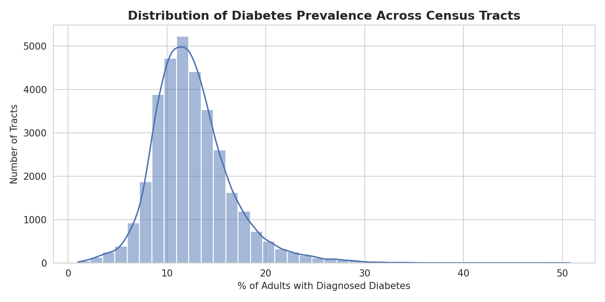
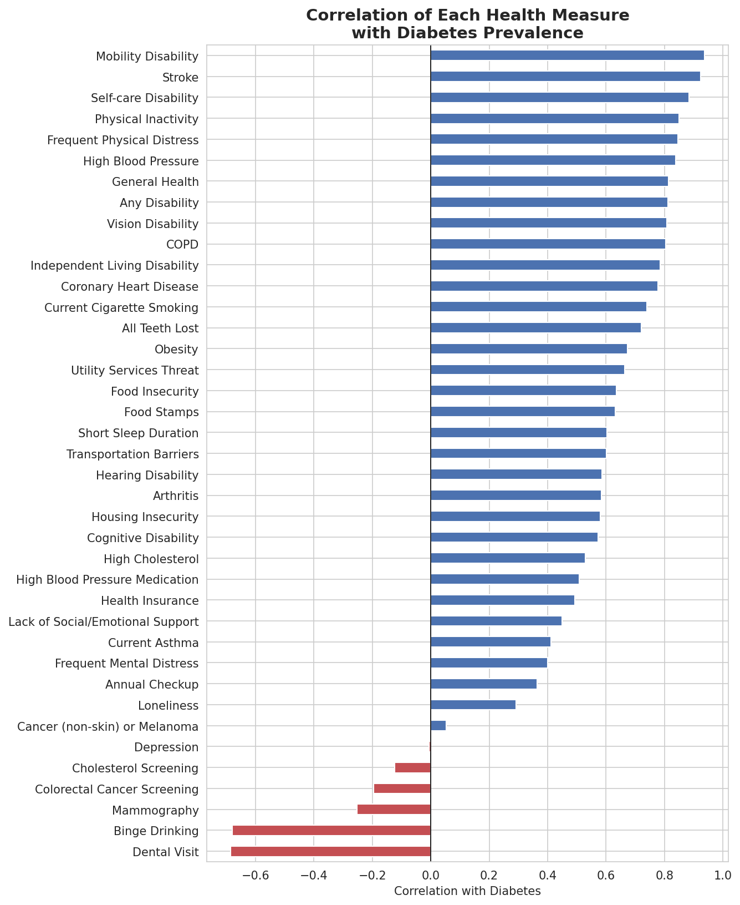
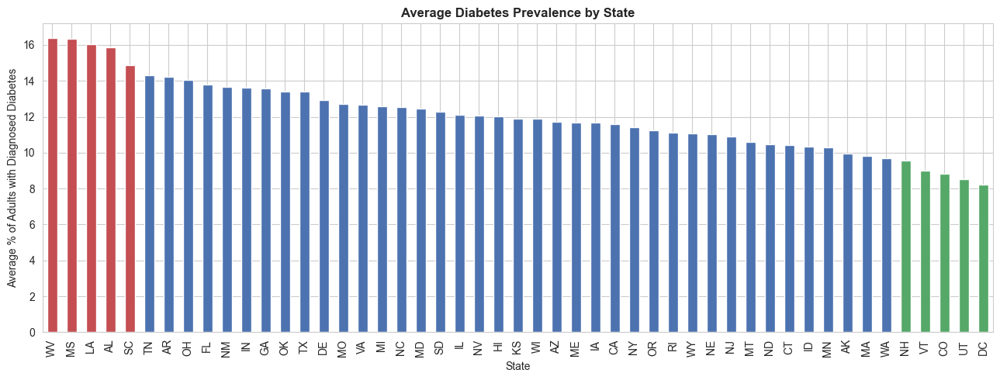
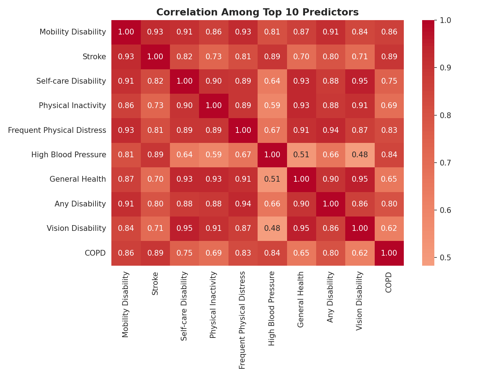
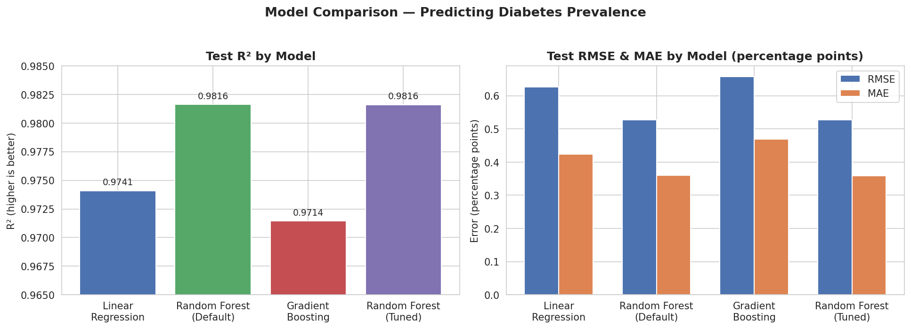
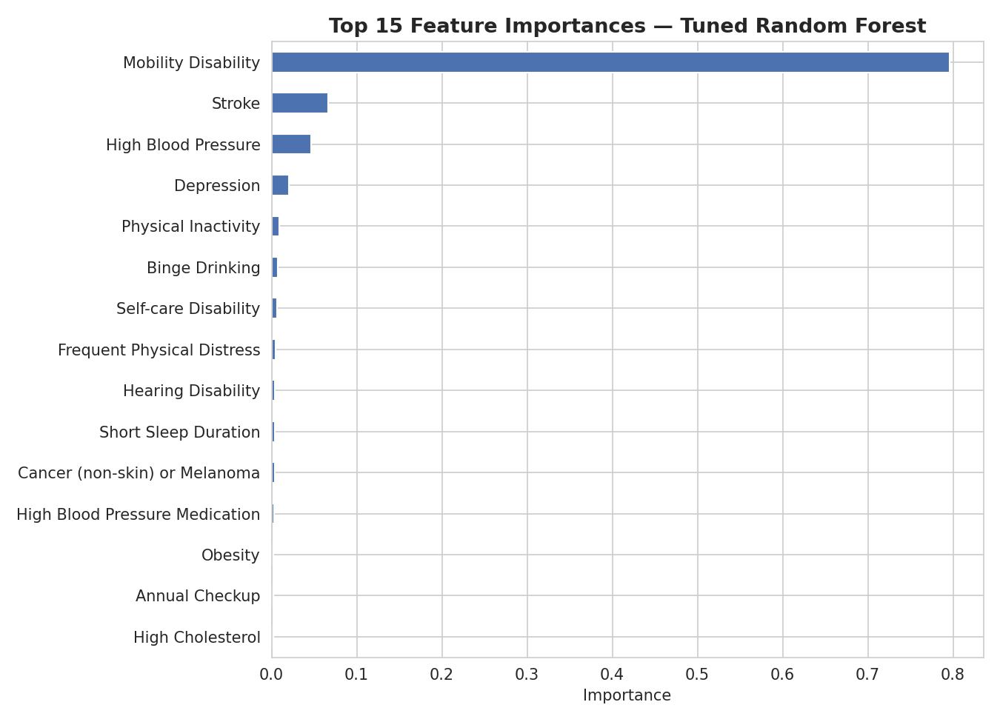

# Predicting Diabetes Prevalence from Neighborhood Health Indicators

Using CDC census-tract-level health data to identify which neighborhood health and behavioral indicators travel most closely with diabetes prevalence — and what that means for targeting public health outreach.

Built as part of the AXSOS Academy Introduction to Machine Learning program's final group project, applying data science and machine learning techniques to a real-world public health dataset.

## Table of Contents
- [Authors](#authors)
- [Executive Summary](#executive-summary)
- [Business Problem](#business-problem)
- [Dataset](#dataset)
- [CRISP-DM Process](#crisp-dm-process)
- [What the Data Shows](#what-the-data-shows)
- [Modeling Approach](#modeling-approach)
- [Results & Evaluation Metrics](#results--evaluation-metrics)
- [Feature Importance](#feature-importance)
- [Business Recommendations](#business-recommendations)
- [Limitations & Honest Caveats](#limitations--honest-caveats)
- [Tools & Libraries](#tools--libraries)
- [Project Structure](#project-structure)
- [Setup & Usage](#setup--usage)
- [Enhancements / Future Work](#enhancements--future-work)
- [Ethical Considerations](#ethical-considerations)

## Authors

This project was built by Group 3 of the AXSOS Academy Introduction to Machine Learning program:

| Name | Role | Primary Responsibility |
|---|---|---|
| **Salam Odeh** | Modeler | Model building, tuning, and evaluation ([LinkedIn](https://www.linkedin.com/in/salam-odeh/)) |
| **Qossay Shtaiwi** | Analyzer / Visualizer | EDA, statistical analysis, charts and visual reporting ([LinkedIn](https://www.linkedin.com/in/qossay-shtaiwi-36a938141/)) |
| **Ali Odah** | Data Wrangler | Data cleaning, missing values, feature engineering ([LinkedIn](https://www.linkedin.com/in/ali-odah/)) |

Although each member owned one primary role, all three collaborated on and understand the complete pipeline — from raw data to final model — as well as the dataset, methodology, results, and conclusions presented here.

## Executive Summary

Using CDC PLACES census-tract-level health data covering **78,784 U.S. neighborhoods across 49 states + DC**, a Random Forest regression model can estimate a neighborhood's adult diabetes prevalence with very high accuracy (**test R² ≈ 0.986**, average error of roughly **0.35 percentage points**). The single strongest signal is the neighborhood's **mobility disability rate**, followed by **high blood pressure prevalence** and **stroke prevalence** — together painting a consistent picture of neighborhoods where cardiovascular and metabolic health issues cluster together. Importantly, we found that the model's very high accuracy is partly a byproduct of how the dataset itself was built (see [Limitations](#limitations--honest-caveats)) rather than a sign of an unusually powerful predictive breakthrough — a distinction we think is more useful to state plainly than to gloss over.

## Business Problem

Public health departments and community health organizations have limited outreach budgets and can't run diabetes-prevention programs everywhere at once. This project asks: **which neighborhood-level health and behavioral indicators are most strongly associated with high diabetes prevalence**, and can that association be used to help prioritize where screening, prevention, and outreach resources go first? Framed as a regression problem, the goal is to predict a census tract's adult diabetes prevalence (%) from the other health, disability, prevention, and social-needs measures available for that tract.

## Dataset

**PLACES: Local Data for Better Health, Census Tract Data (2024 release)**, published by the CDC's Division of Population Health in partnership with the Robert Wood Johnson Foundation and the CDC Foundation, sourced via [Data.gov](https://catalog.data.gov/).

- **3,047,284 rows** in the raw long-format export (one row per tract per health measure, 24 columns), pivoted to **83,522 census tracts** before any target-based filtering. After dropping tracts missing the `Diabetes` target and removing statistically unstable tracts (see below), the final modeling dataset covers **78,784 census tracts across 49 of 50 U.S. states + DC** — only **Kentucky and Pennsylvania** are absent. This is a substantially broader pull than earlier drafts of this dataset, though it still isn't literally all 50 states.
- **40 model-based health measures** per tract, spanning 6 categories:

| Category | Examples |
|---|---|
| Health Outcomes | Diabetes, arthritis, depression, stroke, coronary heart disease, COPD |
| Prevention | Annual checkup, dental visit, mammography, cholesterol/cancer screening |
| Health Risk Behaviors | Smoking, binge drinking, physical inactivity, short sleep duration |
| Disability | Mobility, hearing, vision, cognitive, self-care, independent living |
| Health Status | Self-rated general health, frequent physical/mental distress |
| Health-Related Social Needs | Food insecurity, housing insecurity, lack of insurance, lack of transportation |

**Target variable:** `Diabetes` — % of adults with diagnosed diabetes (crude prevalence), chosen as a well-understood outcome with strong, interpretable predictors already present in the dataset.

**Data quality notes:** `LocationName`/`CountyFIPS` tract IDs were loaded as strings to preserve leading zeros; the export was 100% "Crude prevalence" values already, with zero exact duplicate rows and zero duplicated (tract, measure) observations; two fully-empty metadata columns were dropped, and all percentage, confidence-limit, population, and geographic-identifier values passed validation with zero invalid records. After pivoting to wide format, **4,707 tracts (~5.6%)** were missing the `Diabetes` target and were dropped rather than imputed; remaining missing feature values (ranging from 0% up to ~27.7% for the newer Social Needs measures) were median-imputed; **31 tracts** with populations under 100 were then removed as statistically unstable. Final clean dataset: **78,784 tracts × 48 columns**.

> The raw CSV (`export.csv`) and the cleaned output (`places_wide_clean.csv`) are included in this repo under `data/`.

## CRISP-DM Process

This project follows the **CRISP-DM** (Cross-Industry Standard Process for Data Mining) framework, mapped onto our three team roles and notebooks:

| CRISP-DM Phase | What We Did | Owner / Notebook |
|---|---|---|
| **1. Business Understanding** | Defined the problem as predicting neighborhood-level diabetes prevalence to support public health outreach targeting | Whole team |
| **2. Data Understanding** | Explored the PLACES dataset's structure, measures, and known methodology/limitations | Data Wrangler + Analyzer |
| **3. Data Preparation** | Validated data quality, pivoted long→wide format, merged reference columns, handled missing values, filtered unstable tracts | Data Wrangler (`01_data_cleaning.ipynb`) |
| **4. Modeling** | Built and compared Linear Regression, Random Forest, and Gradient Boosting; tuned the best model with `GridSearchCV` | Modeler (`03_modeling.ipynb`) |
| **5. Evaluation** | Compared models on R², RMSE, and MAE; checked for overfitting; interpreted feature importances against EDA findings; documented limitations | Analyzer + Modeler |
| **6. Deployment** | Packaged as a GitHub repo with reproducible notebooks, a shared clean dataset, and this README summarizing findings for a non-technical audience | Whole team |

We treated Evaluation as more than a scoreboard: a deliberate part of this phase was checking *why* the model performed so well and being explicit about what that accuracy does and doesn't mean (see [Limitations](#limitations--honest-caveats)).

## What the Data Shows

**The average census tract has about 12.4% of adults with diagnosed diabetes**, with most tracts falling between 9.8% and 14.5%, and a right-skewed tail of higher-prevalence outlier tracts.



**Disability, inactivity, and cardiovascular measures show the strongest relationship with diabetes prevalence.** Correlating all 39 other health measures against `Diabetes`, the strongest positive relationships (r > 0.8) were `Mobility Disability`, `Stroke`, `Self-care Disability`, `Frequent Physical Distress`, `Physical Inactivity`, `High Blood Pressure`, `General Health`, `Vision Disability`, `Any Disability`, and `COPD`. The strongest negative relationships were `Binge Drinking` and `Dental Visit` — both more plausibly proxies for population age and healthcare access than direct protective effects.



**A clear regional pattern emerged**, consistent with the well-documented U.S. "Diabetes Belt": West Virginia, Mississippi, Louisiana, Alabama, and South Carolina had the highest average tract-level diabetes prevalence (14.9%–16.4%), while New Hampshire, Vermont, Colorado, Utah, and DC had the lowest (8.2%–9.5%).



**One data-labeling issue is worth flagging explicitly:** the column named `Health Insurance` actually measures the *lack* of insurance coverage (per CDC's own measure description), not coverage itself. Its positive correlation with diabetes prevalence (r ≈ 0.53) makes sense once read correctly — more uninsured adults, higher diabetes prevalence — but the raw column name is easy to misread in the opposite direction.

**Several of the strongest predictors are highly correlated with each other** (e.g. `Mobility Disability` and `Stroke`, r ≈ 0.95, and `Self-care Disability` and `Vision Disability`, r ≈ 0.97), a multicollinearity pattern that informed our choice to favor tree-based models over a purely linear approach.



## Modeling Approach

Three models were built and compared, each using the same 75/25 train/test split (`random_state=42`) for a fair comparison:

1. **Baseline — Linear Regression.** Scaled features feeding a standard Linear Regression, used primarily as an interpretability and performance floor rather than a candidate for production, given the multicollinearity noted above.
2. **Random Forest (default, then tuned).** Chosen as the primary candidate since tree-based models handle correlated features more gracefully than linear models. Tuned via `GridSearchCV` across `n_estimators`, `max_depth`, and `min_samples_leaf`.
3. **Gradient Boosting (default).** Included as a second tree-based comparison point.

## Results & Evaluation Metrics

Since this is a **regression** task (predicting a continuous percentage, not a category), we evaluated models on **R² (variance explained), RMSE, and MAE** rather than accuracy/F1 — RMSE and MAE are both reported in percentage points of diabetes prevalence, which makes them directly interpretable (e.g. "off by about a third of a percentage point on average").



| Model | Test R² | Test RMSE | Test MAE | Takeaway |
|---|---|---|---|---|
| Linear Regression (Baseline) | 0.985 | 0.494 | 0.386 | Strong floor, but coefficients are unstable given multicollinearity |
| Gradient Boosting (Default) | 0.977 | 0.609 | 0.467 | Behind both Random Forest variants; not worth the added tuning complexity here |
| Random Forest (Default) | 0.986 | 0.483 | 0.352 | Best default performer, small train/test gap (no meaningful overfitting) |
| **Random Forest (Tuned, `GridSearchCV`)** | **0.9856** | **0.481** | **0.350** | **Recommended model** — confirms the default was already near-optimal |

**Which model to use, and why:** we recommend the **tuned Random Forest**. It had the best out-of-the-box performance of the three baselines, tolerates the multicollinearity in this feature set far better than Linear Regression, and tuning confirmed (rather than dramatically changed) its performance — a reassuring sign that the untuned result wasn't a fluke. Gradient Boosting was competitive but never surpassed Random Forest here, and Linear Regression's coefficients aren't reliable enough to use for explanation given how correlated the inputs are, even though its raw accuracy is close.

**A necessary caveat on these numbers:** every model here scores above R² = 0.97, which is unusually high for real-world tabular data. We traced this to the dataset's construction (see [Limitations](#limitations--honest-caveats)) rather than treating it as a triumph of modeling — a smaller, more normal-looking R² on truly independent data would not have surprised us, and we think it's important to say so rather than only report the headline number.

## Feature Importance

Using the tuned Random Forest's built-in feature importances:



| Rank | Feature | Importance |
|---|---|---|
| 1 | Mobility Disability | ~0.85 |
| 2 | High Blood Pressure | ~0.05 |
| 3 | Stroke | ~0.03 |
| 4 | Depression | ~0.01 |
| 5 | Current Asthma | ~0.01 |

**`Mobility Disability` dominates the model by a wide margin** — roughly 85% of the total importance — with `High Blood Pressure` and `Stroke` a distant second and third. This matches the Analyzer's correlation ranking closely (`Mobility Disability` had the single highest correlation with `Diabetes`, r ≈ 0.95), which gives us confidence this isn't a modeling artifact.

**We'd frame this finding carefully rather than triumphantly:** the concentration of importance in one feature is consistent with the multicollinearity noted earlier — several top predictors move together so closely that the model may be treating them as largely redundant and leaning on whichever one happens to align best. The defensible takeaway is **"disability and inactivity indicators are the strongest neighborhood-level signal for diabetes prevalence in this dataset,"** not that mobility issues directly cause diabetes, or that the other four categories of measures (prevention, risk behaviors, social needs) are unimportant to public health outcomes more broadly — only that they carry comparatively little *additional* predictive information once mobility, stroke, and blood pressure rates are already known.

## Business Recommendations

1. **Use disability and cardiovascular indicators as an early screening layer for outreach targeting.** Neighborhoods with high rates of mobility disability, stroke, and high blood pressure are strong candidates for prioritized diabetes screening and prevention programs, even before more detailed local data is available.
2. **Treat this as a targeting tool, not a diagnostic one.** The model estimates *neighborhood* prevalence, not individual risk — it should guide where to allocate outreach resources, not decide any individual's care.
3. **Pair quantitative targeting with local context.** Since several of the top predictors are highly correlated, on-the-ground knowledge of a specific neighborhood (e.g. access to grocery stores, walkability, clinic proximity) will make targeting decisions more actionable than the model output alone.
4. **Revisit the `Health Insurance` field's labeling in any downstream reporting.** Since it actually measures lack of coverage, mislabeling it in a stakeholder-facing dashboard could lead to a directionally backwards recommendation.
5. **Re-run this analysis as new PLACES releases come out, and re-pull the `Diabetes` measure specifically.** Coverage is now close to national (49 of 50 states + DC), but Kentucky and Pennsylvania are still missing — closing that gap in future work would make targeting recommendations fully nationwide.

## Limitations & Honest Caveats

We think this section is as important as the results themselves:

1. **Ecological correlation, not individual prediction.** Every value in this dataset is a neighborhood-level percentage, not an individual health record. A tract with high obesity and high diabetes prevalence doesn't mean any specific obese resident has diabetes.
2. **Shared statistical origin inflates apparent predictability.** All 40 PLACES measures (including our target) are generated by the *same* CDC small-area estimation model, built from the *same* underlying BRFSS survey and Census data. This is very likely why every model tested here exceeds R² = 0.97 — a level of "predictability" that would be unusual for genuinely independent, separately-collected data sources.
3. **Correlation, not causation.** For example, `Binge Drinking`'s negative correlation with diabetes prevalence is more plausibly explained by a shared factor (population age skewing younger) than by alcohol use protecting against diabetes.
4. **Multicollinearity concentrates feature importance.** A cluster of highly-correlated top features can make a single one (here, `Mobility Disability`) look disproportionately dominant.
5. **Scope limitation.** The modeling dataset covers **49 of 50 states + DC** — only Kentucky and Pennsylvania are absent. This is close to a full national picture, but findings still describe the tracts present in this dataset, not literally every U.S. state.

None of this means the analysis isn't useful — it genuinely identifies which neighborhood health indicators travel together most closely with diabetes prevalence, which is exactly the kind of finding a public health team would want for prioritizing outreach. It means the results should be presented as **strong neighborhood-level statistical associations**, not as a validated causal or individual-level diagnostic tool.

## Tools & Libraries

| Category | Tools |
|---|---|
| Language / Environment | Python 3, Google Colab (Jupyter notebooks) |
| Data handling | `pandas`, `numpy` |
| Visualization | `matplotlib`, `seaborn` |
| Modeling & preprocessing | `scikit-learn` (`LinearRegression`, `RandomForestRegressor`, `GradientBoostingRegressor`, `GridSearchCV`, `SimpleImputer`, `StandardScaler`, `ColumnTransformer`, `Pipeline`) |
| Version control & collaboration | Git & GitHub (feature branches + pull request review) |
| Presentation | Slides built from notebook visuals and findings (see `presentation/`) |

## Project Structure

```
.
├── README.md
├── assets/                          # charts used in this README
├── data/
│   ├── export.csv                    # raw PLACES export (source data)
│   └── places_wide_clean.csv         # cleaned, wide-format, modeling-ready dataset
├── notebooks/
│   ├── 01_data_cleaning.ipynb        # Data Wrangler: cleaning, pivoting, imputation
│   ├── 02_eda.ipynb                  # Analyzer: correlations, visuals, EDA findings
│   └── 03_modeling.ipynb             # Modeler: baseline models, tuning, evaluation
├── data_dictionary.md                # description of every column in the clean dataset
└── presentation/
    └── slides.pdf                    # final presentation deck
```

## Setup & Usage

```bash
git clone <your-repo-url>
cd <repo-name>
```

These notebooks were built and run in **Google Colab**, so each one starts by mounting Google Drive:

```python
from google.colab import drive
drive.mount('/content/drive')
```

Update the `fpath` variable at the top of each notebook to point to wherever `export.csv` / `places_wide_clean.csv` live in your Drive. Run the notebooks **in order** — `01_data_cleaning.ipynb` → `02_eda.ipynb` → `03_modeling.ipynb` — since each stage depends on the output of the one before it.

## Enhancements / Future Work

- **Close the remaining state gap:** re-pull the PLACES export to include Kentucky and Pennsylvania, the only two states not yet represented in the modeling dataset, for literally full 50-state + DC coverage.
- **Try a classification framing as a stretch goal:** convert `Diabetes` into a High-risk / Low-risk label (e.g. split at the median) and compare a classification approach (with a confusion matrix and precision/recall trade-off discussion) against the regression results here.
- **Address multicollinearity directly:** experiment with Ridge/Lasso regression, or drop/combine redundant features (e.g. via PCA on the disability-related measures) to see whether a more stable linear model can get closer to the Random Forest's performance while staying interpretable.
- **Model interpretability:** add SHAP values to explain individual tract-level predictions, not just global feature importance.
- **Cross-validation:** report k-fold CV scores with confidence intervals rather than a single train/test split, for a more robust performance estimate.
- **Geospatial modeling:** incorporate the `Geolocation` field directly (e.g. spatial clustering or a spatial regression term) to formally test whether nearby tracts have correlated diabetes rates beyond what the health measures alone explain.

## Ethical Considerations

This dataset does not include individually identifiable information — all measures are aggregated to the census-tract level — but it does describe sensitive health conditions and behaviors for real communities. A few considerations for any real-world use of this analysis:

- **Avoid stigmatizing communities.** Presenting a neighborhood's high diabetes or disability rate without context (e.g. access to healthy food, healthcare, safe places to exercise) risks reducing a community to a single statistic rather than informing genuine support.
- **Use for resource allocation, not exclusion.** This kind of model is appropriate for prioritizing where to *add* public health resources (screening, education, clinics) — it would be inappropriate to use it to justify withholding services, raising insurance-like costs, or any individually punitive action, especially given the ecological-correlation limitation above.
- **Respect the small-area estimate methodology.** CDC explicitly cautions that PLACES' model-based small-area estimates should not be used to evaluate the effects of local programs or policies, since the model cannot detect effects from local interventions — a caution we'd pass along to anyone using this repo's findings operationally.
